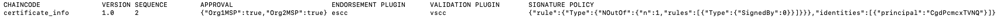

# Adding organization to channel in multi cluster

This tutorial will guide you deploying new organization to exisitng channel in multi cluster environment. This process require cooperation of `Admin Org1` and `Admin Org2`. There will be back and forth process to export crypto material and signed channel configuration.

All examples scripts is executed from working directory: `~/hlf-operator`.

## Prerequisites

Before start this tutorial please complete [deploying first organization cluster](../../README.md). For Org2 also follow same [steps](../../README.md) to setup environment but skip `deploy-fabric.sh`.

install required application: [jq](https://stedolan.github.io/jq/download/), [yq](https://github.com/kislyuk/yq#installation), and `configtxlator` from [fabric-binaries](https://github.com/hyperledger/fabric/releases/tag/v2.4.3).

```bash
cd ~

wget https://github.com/stedolan/jq/releases/download/jq-1.6/jq-linux64
chmod +x jq-linux64
sudo mv jq-linux64 /usr/local/bin/jq

# alternatively can use: pip3 install yq
pip install yq 

wget https://github.com/hyperledger/fabric/releases/download/v2.4.3/hyperledger-fabric-linux-amd64-2.4.3.tar.gz
sudo mkdir /usr/local/fabric-binaries
sudo tar -C /usr/local/fabric-binaries -xzf hyperledger-fabric-linux-amd64-2.4.3.tar.gz

# Remember to append /usr/local/fabric-binaries to env PATH
```

### P2P Connectivity

Org1 machine and Org2 machine must be able to reach each other node. The recommended setting is to whitelist inbound IP address of other peer with all or partial port number (see network config).

## Exports Template

Below are exports that use in this tutorial examples for both Org1 and Org2.

```bash
export PEER_IMAGE=quay.io/kfsoftware/fabric-peer
export PEER_VERSION=2.4.1-v0.0.3

export ORDERER_IMAGE=hyperledger/fabric-orderer
export ORDERER_VERSION=2.4.1

export HLF_STORAGE_CLASS=microk8s-hostpath # default: standard
export CHANNEL_ID=ecertplatform

# ORG 1
export ORG1_MSP=Org1MSP
export ORG1_NAME=org1
export ORG1_NAMESPACE=default

export ORG1_ADMIN_USER=admin
export ORG1_ORD_MSP=OrdererMSP
export ORG1_ORD_CA=ord-ca
export ORG1_PEER0=${ORG1_NAME}-peer0.${ORG1_NAMESPACE}

# ORG 2
export ORG2_MSP=Org2MSP
export ORG2_NAME=org2
export ORG2_NAMESPACE=default
export ORG2_ADMIN_USER=admin-org2
export ORG2_ADMIN_SECRET=adminpw

export ORG2_CA=${ORG2_NAME}-ca
export ORG2_ORD_NODE1=${ORG2_NAME}-ord-node1
export ORG2_PEER0=${ORG2_NAME}-peer0.${ORG2_NAMESPACE}

# CHAINCODE
export CC_NAME=certificate_info
export CC_VERSION="1.0"
export CC_SEQUENCE=2
```

Apply exports to current terminal session with `source` and run example scripts.

```bash
source ./samples/adding-org-to-channel-in-multicluster/org-exports.sh

# Run example command
```

## Using Template Scripts

We provide template scripts that are separated for [Org1](/samples/adding-org-to-channel-in-multicluster/org1-scripts/) and [Org2](/samples/adding-org-to-channel-in-multicluster/org2-scripts/). Both template scripts depend on [org-exports.sh](/samples/adding-org-to-channel-in-multicluster/org-exports.sh).

The template scripts does not cover manual steps such sending files and notify other organization. You still need to refer to this guide and follow the step. If there is any step fail, please debug it before continue.

## Step 1: Create Certificate Authority (CA) and Peer for Org2

**In Org2 machine.**

The first step is to create `CA` and one `peer` for Org2.

```bash
# Create CA
kubectl hlf ca create \
    --storage-class "${HLF_STORAGE_CLASSS}" \
    --capacity 2Gi \
    --namespace "${ORG2_NAMESPACE}" \
    --name "${ORG2_CA}" \
    --enroll-id enroll \
    --enroll-pw enrollpw

kubectl wait --timeout=180s --for=condition=Running fabriccas.hlf.kungfusoftware.es --all

# Register user for the peer
kubectl hlf ca register \
    --name "${ORG2_CA}" \
    --user peer \
    --secret peerpw \
    --type peer \
    --enroll-id enroll \
    --enroll-secret enrollpw \
    --mspid "${ORG2_MSP}" \
    --namespace "${ORG2_NAMESPACE}"

# Create Peer
kubectl hlf peer create \
    --statedb couchdb \
    --image "${PEER_IMAGE}" \
    --version "${PEER_VERSION}" \
    --storage-class "${HLF_STORAGE_CLASS}" \
    --capacity 5Gi \
    --enroll-id peer \
    --enroll-pw peerpw \
    --mspid "${ORG2_MSP}" \
    --namespace "${ORG2_NAMESPACE}" \
    --name "${ORG2_NAME}-peer0" \
    --ca-name "${ORG2_CA}.${ORG2_NAMESPACE}"

kubectl wait --timeout=180s --for=condition=Running fabricpeers.hlf.kungfusoftware.es --all
```

## Step 2: Create Admin Org2 in Org1 Orderer CA

**In Org1 machine.**

In this step, create Org2 admin user in Org1 Orderer CA.

```bash
kubectl hlf ca register \
    --name "${ORG1_ORD_CA}" \
    --user "${ORG2_ADMIN_USER}" \
    --secret "${ORG2_ADMIN_SECRET}" \
    --type admin \
    --enroll-id enroll \
    --enroll-secret enrollpw \
    --namespace "${ORG1_NAMESPACE}" \
    --mspid "${ORG1_ORD_MSP}"

kubectl hlf ca enroll \
    --name "${ORG1_ORD_CA}" \
    --user "${ORG2_ADMIN_USER}" \
    --secret "${ORG2_ADMIN_SECRET}" \
    --namespace "${ORG1_NAMESPACE}" \
    --mspid "${ORG1_ORD_MSP}" \
    --ca-name ca \
    --output admin-ordservice.yaml

kubectl hlf utils adduser \
    --userPath admin-ordservice.yaml \
    --config ordservice.yaml \
    --username "${ORG2_ADMIN_USER}" \
    --mspid "${ORG1_ORD_MSP}"

kubectl hlf ca enroll \
    --name "${ORG1_ORD_CA}" \
    --user "${ORG2_ADMIN_USER}" \
    --secret "${ORG2_ADMIN_SECRET}" \
    --namespace "${ORG1_NAMESPACE}" \
    --mspid "${ORG1_ORD_MSP}" \
    --ca-name tlsca \
    --output admin-tls-ordservice.yaml
```

## Step 3: Create Admin Org2 in Org2 CA

**In Org2 machine.**

```bash
kubectl hlf ca register \
    --name "${ORG2_CA}" \
    --user "${ORG2_ADMIN_USER}" \
    --secret "${ORG2_ADMIN_SECRET}" \
    --type admin \
    --enroll-id enroll \
    --enroll-secret enrollpw \
    --namespace "${ORG2_NAMESPACE}" \
    --mspid "${ORG2_MSP}"

kubectl hlf ca enroll \
    --ca-name ca \
    --name "${ORG2_CA}" \
    --user "${ORG2_ADMIN_USER}" \
    --secret "${ORG2_ADMIN_SECRET}" \
    --namespace "${ORG2_NAMESPACE}" \
    --mspid "${ORG2_MSP}" \
    --output "peer-${ORG2_NAME}.yaml"

kubectl hlf inspect --output "${ORG2_NAME}.yaml" -o "${ORG2_MSP}"

kubectl hlf utils adduser \
    --userPath "peer-${ORG2_NAME}.yaml" \
    --config "${ORG2_NAME}.yaml" \
    --username "${ORG2_ADMIN_USER}" \
    --mspid "${ORG2_MSP}"

# Wait few seconds here before proceed
```

## Step 4: Update channel configuration

In this step, we will modify channel configuration and envelope config in protobuf format. After that, `Org1` and `Org2` need to sign the update then Org1 can commit channel update.

### Step 4.1: Prepare crypto material of Org2

**In Org2 machine.**

Admin Org2 perform export Org2 crypto material and send it to Admin Org1.

```bash
kubectl hlf org inspect --output-path crypto-config -o "${ORG2_MSP}"
```

The command will generate crypto material (refer to images below).

Send `org2.yaml`, `configtx.yaml`, and all files in `crypto-config` (keep structure) to Org1.


### Step 4.2: Combine Org2 network config

**In Org1 machine.**

Following previous step, Admin Org1 receive Org2 crypto material. Copy the files and keep same structure.

```bash
# Output (shared) network configuration of Org1 and Org2
kubectl hlf inspect --output networkConfig.yaml -o "${ORG1_MSP}" -o "${ORG1_ORD_MSP}"

# Backup original config
cp networkConfig.yaml networkConfig.bak.yaml

yq --yaml-output -s '.[0] * {"organizations":{"'${ORG1_ORD_MSP}'":{"users": .[1].organizations.'${ORG1_ORD_MSP}'.users }}}' \
    networkConfig.yaml ordservice.yaml > networkConfig-out1.yaml

yq --yaml-output -s '.[0] * {"organizations":{"'${ORG1_MSP}'":{"users": .[1].organizations.'${ORG1_MSP}'.users }}}' \
    networkConfig-out1.yaml "${ORG1_NAME}.yaml" > networkConfig-out2.yaml

yq --yaml-output -s '.[0] * {"organizations":{"'${ORG2_MSP}'":{"users": .[1].organizations.'${ORG2_MSP}'.users, "cryptoPath": .[1].organizations.'${ORG2_MSP}'.cryptoPath }}}' \
    networkConfig-out2.yaml "${ORG2_NAME}.yaml" > networkConfig-out3.yaml

# Override network config
mv networkConfig-out3.yaml networkConfig.yaml
```

### Step 4.3: Output channel add org configuration

**In Org1 machine.**

```bash
# Output channel update config
kubectl hlf channel addorg \
    --name "${CHANNEL_ID}" \
    --config networkConfig.yaml \
    --user "${ORG1_ADMIN_USER}" \
    --peer "${ORG1_PEER0}" \
    --msp-id "${ORG2_MSP}" \
    --org-config configtx.yaml \
    --dry-run > "${ORG2_NAME}.json"
```

### Step 4.4: Encode channel config update

**In Org1 machine.**

- In this step, `org2.yaml` need to be updated with orderer config from `ordservice.yaml`. This process will be covered in the next commands example. There are 2 locations to update:

  - `channel._default.orderers`

    

  - `orderers`

    

- Run this commands:

    ```bash
    # Output org2_update_in_envelope.pb
    echo '{"payload":{"header":{"channel_header":{"channel_id":"'${CHANNEL_ID}'","type":2}},"data":{"config_update":'$(cat ${ORG2_NAME}.json)'}}}' | jq . > "${ORG2_NAME}_update_in_envelope.json"

    configtxlator proto_encode --type common.Envelope --input "${ORG2_NAME}_update_in_envelope.json" --output "${ORG2_NAME}_update_in_envelope.pb"

    # Update org2.yaml with orderer
    yq --yaml-output -s '.[0] * {"orderers":.[1].orderers}' \
        "${ORG2_NAME}.yaml" ordservice.yaml > "${ORG2_NAME}-out1.yaml"

    yq --yaml-output -s '.[0] * {"channels":{"_default":{"orderers": .[1].channels._default.orderers }}}' \
        "${ORG2_NAME}-out1.yaml" ordservice.yaml > "${ORG2_NAME}-out2.yaml"

    # Backup original org2 config
    mv "${ORG2_NAME}.yaml" "${ORG2_NAME}.yaml.backup"

    # Rename output to org2.yaml
    mv "${ORG2_NAME}-out2.yaml" "${ORG2_NAME}.yaml"
    ```

- Send `org2.yaml` and `org2_update_in_envelope.pb` to Org2.

### Step 4.5: Sign channel config update in Org1

**In Org1 machine.**

The last step in channel config is to sign update then gather signed files in Org1.

```bash
kubectl hlf channel signupdate \
    --channel "${CHANNEL_ID}" \
    -f "${ORG2_NAME}_update_in_envelope.pb" \
    --user "${ORG1_ADMIN_USER}" \
    --config networkConfig.yaml \
    --mspid "${ORG1_MSP}" \
    --output "${ORG1_NAME}-${CHANNEL_ID}-sign.pb"
```

### Step 4.6: Sign channel config update in Org2

**In Org2 machine.**

- Get updated `org2.yaml` and `org2_update_in_envelope.pb` from Org1.

  Before overwrite `org2.yaml`, you can rename existing config to `org2.yaml.backup`.

    ```bash
    kubectl hlf channel signupdate \
        --channel "${CHANNEL_ID}" \
        -f "${ORG2_NAME}_update_in_envelope.pb" \
        --user "${ORG2_ADMIN_USER}" \
        --config "${ORG2_NAME}.yaml" \
        --mspid "${ORG2_MSP}" \
        --output "${ORG2_NAME}-${CHANNEL_ID}-sign.pb"
    ```

- Send `org2-ecertplatform-sign.pb` to Org1.

### Step 4.7: Submit channel config update in Org1

**In Org1 machine.**

Prepare `org2_update_in_envelope.pb`, `org1-ecertplatform-sign.pb`, and `org2-ecertplatform-sign.pb` then execute this command to update channel configuration.

```bash
kubectl hlf channel update \
    --channel "${CHANNEL_ID}" \
    -f "${ORG2_NAME}_update_in_envelope.pb" \
    --config networkConfig.yaml \
    --user "${ORG1_ADMIN_USER}" \
    --mspid "${ORG1_MSP}" \
    -s "${ORG1_NAME}-${CHANNEL_ID}-sign.pb" \
    -s "${ORG2_NAME}-${CHANNEL_ID}-sign.pb"
```

Example response:


## Step 5: Join channel

**In Org2 machine.**

After channel configuration updated, Org2 can join the channel and fetch channel configuration.

```bash
kubectl hlf channel join \
    --name "${CHANNEL_ID}" \
    --config "${ORG2_NAME}.yaml" \
    --user "${ORG2_ADMIN_USER}" \
    --peer "${ORG2_PEER0}"

kubectl hlf channel inspect \
    --channel "${CHANNEL_ID}" \
    --config "${ORG2_NAME}.yaml" \
    --user "${ORG2_ADMIN_USER}" \
    --peer "${ORG2_PEER0}" > "${CHANNEL_ID}.json"

kubectl hlf channel addanchorpeer \
    --channel "${CHANNEL_ID}" \
    --config "${ORG2_NAME}.yaml" \
    --user "${ORG2_ADMIN_USER}" \
    --peer "${ORG2_PEER0}"
```

Example response:


## Step 6: Install Chaincodes

To install chaincode, Org2 need approval from other Org for each chaincode deployment. Below we demonstrate the steps to deploy `certificate_info` chaincode. For other chaincode can repeat these steps by replacing `CC_NAME` and `CC_SEQUENCE` in [org-exports.sh](/samples/adding-org-to-channel-in-multicluster/org-exports.sh).

### Step 6.1: Install chaincode in Org2

**In Org2 machine.**

```bash
kubectl hlf chaincode install \
    --path "./fixtures/chaincodes/${CC_NAME}" \
    --config "${ORG2_NAME}.yaml" \
    --language golang \
    --label "${CC_NAME}" \
    --user "${ORG2_ADMIN_USER}" \
    --peer "${ORG2_PEER0}"

kubectl hlf chaincode queryinstalled \
    --config "${ORG2_NAME}.yaml" \
    --user "${ORG2_ADMIN_USER}" \
    --peer "${ORG2_PEER0}"

PACKAGE_ID=`kubectl hlf chaincode queryinstalled --config=${ORG2_NAME}.yaml --user=${ORG2_ADMIN_USER} --peer=${ORG2_PEER0} | awk -v cc_name="${CC_NAME}" '{ if ($2 == cc_name) print $1 }'`
echo "${PACKAGE_ID}"

kubectl hlf chaincode approveformyorg \
    --config "${ORG2_NAME}.yaml" \
    --user "${ORG2_ADMIN_USER}" \
    --peer "${ORG2_PEER0}" \
    --package-id "${PACKAGE_ID}" \
    --name "${CC_NAME}" \
    --version "${CC_VERSION}" \
    --sequence "${CC_SEQUENCE}" \
    --policy "OR('${ORG1_MSP}.member')" \
    --channel "${CHANNEL_ID}"
```

Below is example response after install chaincode. However, you still need approval from other Org to run in your Org.


Notify Org1 Admin of `CC_NAME` (chaincode name) and `PACKAGE_ID` values.

### Step 6.2: Approve chaincode in Org1

**In Org1 machine.**

Get `CC_NAME` and `PACKAGE_ID` from Org2 Admin then set environment vars by running `export`.

```bash
export CC_NAME=ORG2_GIVEN_CC_NAME
export PACKAGE_ID=ORG2_GIVEN_PACKAGE_ID
```

Before proceed, please confirm [exports env for chaincode](/samples/adding-org-to-channel-in-multicluster/org-exports.sh#L34-L36) and run `source` again to reload.

Please remember to **increment sequence number by 1** from the last deployed sequence.

```bash
kubectl hlf chaincode approveformyorg \
    --config "${ORG1_NAME}.yaml" \
    --user "${ORG1_ADMIN_USER}" \
    --peer "${ORG1_PEER0}" \
    --package-id "${PACKAGE_ID}" \
    --name "${CC_NAME}" \
    --version "${CC_VERSION}" \
    --sequence "${CC_SEQUENCE}" \
    --policy "OR('${ORG1_MSP}.member')" \
    --channel "${CHANNEL_ID}"

# Wait few seconds here before commit

kubectl hlf chaincode commit \
    --config "${ORG1_NAME}.yaml" \
    --user "${ORG1_ADMIN_USER}" \
    --mspid "${ORG1_MSP}" \
    --name "${CC_NAME}" \
    --version "${CC_VERSION}" \
    --sequence "${CC_SEQUENCE}" \
    --policy "OR('${ORG1_MSP}.member')" \
    --channel "${CHANNEL_ID}"
```

Example response:


Admin Org1 can notify Admin Org2 after finish.

### Step 6.3: Check chaincode status

**In Org2 machine.**

Admin Org2 can check status by executing `querycommitted`. After approved, Org2 can access `certificate_info` chaincode using `org2.yaml` as network config param in fabric API.

```bash
kubectl hlf chaincode querycommitted \
    --peer "${ORG2_PEER0}" \
    --user "${ORG2_ADMIN_USER}" \
    --config "${ORG2_NAME}.yaml" \
    --channel "${CHANNEL_ID}" \
    --chaincode "${CC_NAME}"
```

Example response:



## References

- Fabric Channel Update Tutorial (<https://hyperledger-fabric.readthedocs.io/en/release-2.4/channel_update_tutorial.html>)
- AWS Samples, Part 5: Adding a new member to a Fabric network on Amazon Managed Blockchain (<https://github.com/aws-samples/non-profit-blockchain/blob/master/new-member/README.md>)
- Adding a new Org in MultiCluster Env - Part 16 | Hyperledger Fabric On Kubernetes (<https://www.youtube.com/watch?v=0VUx9CYn4z8&ab_channel=AdityaJoshi>)
